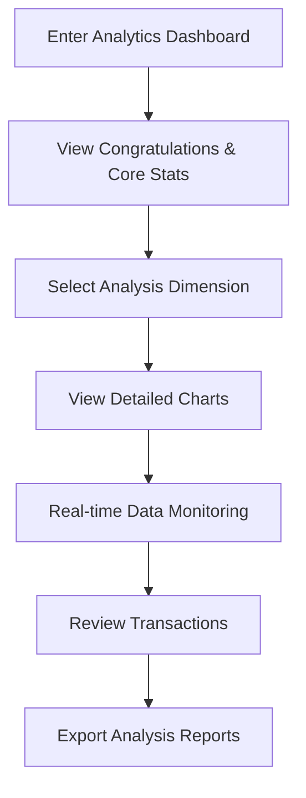

# Analytics Module Refactoring Requirements Document

## 1. Product Overview

Based on the reference design from https://greakproject.vercel.app/dashboards/analytics/, refactor the existing Analytics module by redesigning it into 12 independent functional modules to provide a richer and more intuitive data analysis experience.
- Goal: Create a modern, responsive data analysis dashboard that provides comprehensive business insights and real-time data monitoring capabilities.
- Market Value: Provide enterprise users with professional-grade data analysis tools to help make smarter business decisions.

## 2. Core Features

### 2.1 User Roles
This module is designed for all logged-in users, with no role distinction required. All users can access the complete analytics functionality.

### 2.2 Feature Module

The Analytics refactoring module contains the following 12 core page modules:

1. **Congratulations Module**: Achievement display with sales performance and badge viewing functionality
2. **Order Module**: Order statistics with 276k order data and curve chart
3. **Sales Module**: Sales data display with $4,679 amount, 28.14% growth rate, and icon
4. **Total Revenue Module**: Total revenue with 2023/2024 data switching and circular chart
5. **Payments Module**: Payment data with $2,468 amount and 14.68% decline rate
6. **Revenue Module**: Revenue statistics with 425k data and bar chart
7. **Profit Report Module**: Profit report with $84,686K amount and 68.2% growth rate
8. **Order Statistics Module**: Order statistics with circular chart and 4-item categorized list
9. **Income/Expenses/Profit Module**: Three-tab module for income/expenses/profit analysis
10. **Transactions Module**: Transaction records list with various payment methods
11. **Activity Timeline Module**: Activity timeline with invoices, meetings, and project records
12. **Browser/OS/Country Module**: Three-tab module for access data statistics

### 2.3 Page Details

| Page Name | Module Name | Feature Description |
|-----------|-------------|---------------------|
| Analytics Dashboard | Congratulations Module | Display achievement message "You have done 72% more sales today. Check your new badge in your profile." with "view badges" button and illustration |
| Analytics Dashboard | Order Module | Show 276k order data with curve chart visualization for trend analysis |
| Analytics Dashboard | Sales Module | Display sales amount $4,679 with 28.14% growth rate, featuring icon and trend indicators |
| Analytics Dashboard | Total Revenue Module | Show total revenue with 2023/2024 data selection dropdown and circular chart visualization |
| Analytics Dashboard | Payments Module | Display payment amount $2,468 with 14.68% decline rate and trend indicators |
| Analytics Dashboard | Revenue Module | Show 425k revenue data with bar chart visualization for comparative analysis |
| Analytics Dashboard | Profit Report Module | Display profit amount $84,686K with 68.2% growth rate and performance indicators |
| Analytics Dashboard | Order Statistics Module | Circular chart with 4-category list: Electronic (Mobile, Earbuds, TV - 82.5k), Fashion (Tshirt, Jeans, Shoes - 23.8k), Decor (Fine Art, Dining - 849), Sports (Football, Cricket Kit - 99) |
| Analytics Dashboard | Income/Expenses/Profit Module | Three-tab interface showing total income $459.1k with 42.9% growth and curve chart |
| Analytics Dashboard | Transactions Module | Transaction list with icons: Paypal (+$82.6), Wallet Mac'D (+$270.69), Transfer Refund (+$637.91), Credit Card Food (-$838.71), Wallet Starbucks (+$203.33), Mastercard Food (-$92.45) |
| Analytics Dashboard | Activity Timeline Module | Linear timeline: 12 Invoices paid (12 min ago), Client Meeting (45 min ago), New project creation (2 days ago) with detailed descriptions |
| Analytics Dashboard | Browser/OS/Country Module | Three-tab data table showing browser visits: Chrome (8.92k, 64.91%), Safari (1.29k, 19.03%), Firefox (328, 3.26%), Edge (142, 3.99%), Opera (85, 2.12%), Brave (36, 1.06%) |

## 3. Core Process

After users access the Analytics Dashboard, they can:

1. **Data Overview**: First view the congratulations and core statistics to quickly understand overall business performance
2. **Detailed Analysis**: Conduct detailed data analysis and trend observation through various charts and modules
3. **Real-time Monitoring**: Check real-time notifications and latest activities to stay updated with system dynamics
4. **Transaction Review**: Monitor financial transactions and payment activities
5. **Performance Tracking**: Track order statistics, revenue trends, and profit reports

## 4. User Interface Design

### 4.1 Design Style

- **Primary Colors**: Blue series (#3B82F6) and Purple series (#8B5CF6)
- **Secondary Colors**: Green (#10B981), Orange (#F59E0B), Red (#EF4444)
- **Button Style**: Rounded design with hover effects and click feedback
- **Font**: Inter font family, main title 24px, subtitle 18px, body text 14px
- **Layout Style**: Card-based design, grid layout, responsive adaptation
- **Icon Style**: Heroicons icon library, clean and modern linear icons

### 4.2 Page Design Overview

| Page Name | Module Name | UI Elements |
|-----------|-------------|-------------|
| Analytics Dashboard | Congratulations Module | Congratulations card with illustration, achievement text, "view badges" button, colorful background gradient |
| Analytics Dashboard | Order Module | Order statistics card with 276k display, curve chart visualization, trend indicators |
| Analytics Dashboard | Sales Module | Sales card with $4,679 amount, 28.14% growth badge, sales icon, green trend arrow |
| Analytics Dashboard | Total Revenue Module | Revenue card with 2023/2024 dropdown selector, circular chart, comparative data display |
| Analytics Dashboard | Payments Module | Payment card with $2,468 amount, 14.68% decline badge, payment icon, red trend arrow |
| Analytics Dashboard | Revenue Module | Revenue card with 425k display, bar chart visualization, comparative analysis |
| Analytics Dashboard | Profit Report Module | Profit card with $84,686K amount, 68.2% growth badge, profit icon, green trend arrow |
| Analytics Dashboard | Order Statistics Module | Circular chart with category breakdown, 4-item list with icons and statistics for each category |
| Analytics Dashboard | Income/Expenses/Profit Module | Three-tab interface with $459.1k total income, 42.9% growth, curve chart visualization |
| Analytics Dashboard | Transactions Module | Transaction list with payment method icons, transaction descriptions, amount displays with +/- indicators |
| Analytics Dashboard | Activity Timeline Module | Vertical timeline with time stamps, activity descriptions, file attachments, user information |
| Analytics Dashboard | Browser/OS/Country Module | Three-tab data table with browser statistics, visit counts, percentage bars, ranking numbers |

### 4.3 Responsiveness

- **Desktop (≥1024px)**: 12 modules in 4x3 grid layout, fully utilizing screen space
- **Tablet (768px-1023px)**: Adjusted to 2x6 or 3x4 layout, maintaining good visual proportions
- **Mobile (<768px)**: Single column vertical layout, modules adapt to width, optimized touch interaction

## 5. Footer Content

**Footer Information**: © 2025, Made with ❤️ by ValenciaZhang
**Footer Links**: License | More Themes | Documentation | Support

The footer should maintain consistent styling with the overall design, featuring clean layout, proper link spacing, and responsive behavior across all device sizes.