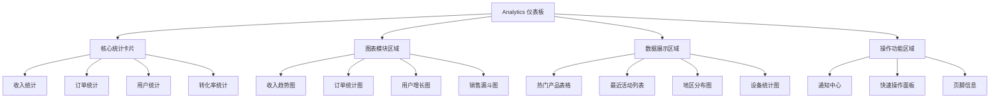

# Analytics 模块重构产品需求文档

## 1. 产品概述

基于参考网站 https://greakproject.vercel.app/dashboards/analytics/ 的设计，重构现有的 Analytics 仪表板页面，将其改造为包含12个独立功能模块的现代化数据分析平台。该重构旨在提升用户体验，优化数据展示效果，并增强交互功能。

## 2. 核心功能

### 2.1 用户角色
| 角色 | 访问权限 | 核心功能 |
|------|----------|----------|
| 管理员 | 完全访问权限 | 查看所有数据、导出报告、配置设置 |
| 分析师 | 数据查看权限 | 查看分析数据、生成报告 |
| 普通用户 | 基础查看权限 | 查看基础统计数据 |

### 2.2 功能模块

我们的Analytics重构需求包含以下12个主要模块：

1. **核心统计卡片区域**：收入统计、订单统计、用户统计、转化率统计
2. **收入趋势图表**：显示收入变化趋势的折线图
3. **订单统计图表**：展示订单数量的柱状图
4. **用户增长图表**：用户增长趋势的面积图
5. **销售漏斗图**：转化漏斗分析图表
6. **热门产品表格**：产品销售排行榜
7. **最近活动列表**：系统活动记录
8. **地区分布图**：用户地理分布数据
9. **设备统计图表**：用户设备使用统计
10. **通知中心**：系统通知和提醒
11. **快速操作面板**：常用功能快捷入口
12. **页脚信息区域**：版权信息和链接

### 2.3 页面详情

| 页面名称 | 模块名称 | 功能描述 |
|----------|----------|----------|
| Analytics 仪表板 | 核心统计卡片 | 显示收入、订单、用户、转化率四个关键指标，支持实时数据更新和趋势对比 |
| Analytics 仪表板 | 收入趋势图表 | 展示时间序列的收入变化，支持时间范围筛选和数据钻取 |
| Analytics 仪表板 | 订单统计图表 | 柱状图显示订单数量分布，支持按时间、类别筛选 |
| Analytics 仪表板 | 用户增长图表 | 面积图展示用户增长趋势，包含新用户和活跃用户数据 |
| Analytics 仪表板 | 销售漏斗图 | 转化漏斗分析，显示从访问到购买的转化路径 |
| Analytics 仪表板 | 热门产品表格 | 产品销售排行，支持排序、搜索和分页功能 |
| Analytics 仪表板 | 最近活动列表 | 显示系统最新活动记录，支持筛选和详情查看 |
| Analytics 仪表板 | 地区分布图 | 用户地理分布可视化，支持地图和列表两种展示方式 |
| Analytics 仪表板 | 设备统计图表 | 用户设备使用情况统计，包含设备类型和浏览器分布 |
| Analytics 仪表板 | 通知中心 | 系统通知和提醒管理，支持标记已读和优先级排序 |
| Analytics 仪表板 | 快速操作面板 | 常用功能快捷入口，包含导出、创建、设置等操作 |
| Analytics 仪表板 | 页脚信息区域 | 版权信息、帮助链接和系统状态显示 |

## 3. 核心流程

用户访问Analytics仪表板后，可以查看12个功能模块的数据展示。用户可以通过以下流程进行操作：

1. **数据查看流程**：进入仪表板 → 查看核心统计 → 分析图表数据 → 查看详细报表
2. **数据筛选流程**：选择时间范围 → 应用筛选条件 → 查看筛选结果 → 导出数据
3. **交互操作流程**：点击图表元素 → 查看详细信息 → 执行相关操作 → 返回主视图

## 4. 用户界面设计

### 4.1 设计风格

- **主色调**：#6366f1 (Indigo-500)，#f8fafc (Gray-50)
- **辅助色**：#10b981 (Emerald-500)，#f59e0b (Amber-500)，#ef4444 (Red-500)
- **按钮样式**：圆角设计，渐变背景，悬停效果
- **字体**：Inter, -apple-system, BlinkMacSystemFont, 'Segoe UI'
- **字体大小**：标题 24px，副标题 18px，正文 14px，小字 12px
- **布局风格**：卡片式设计，网格布局，响应式适配
- **图标风格**：Heroicons 线性图标，统一风格

### 4.2 页面设计概览

| 页面名称 | 模块名称 | UI 元素 |
|----------|----------|---------|
| Analytics 仪表板 | 核心统计卡片 | 白色卡片背景，彩色图标，大号数字显示，绿色/红色趋势箭头，阴影效果 |
| Analytics 仪表板 | 收入趋势图表 | Chart.js 折线图，渐变填充，交互式工具提示，时间轴选择器 |
| Analytics 仪表板 | 订单统计图表 | Chart.js 柱状图，多色柱状，数据标签，图例说明 |
| Analytics 仪表板 | 用户增长图表 | Chart.js 面积图，渐变填充，平滑曲线，数据点标记 |
| Analytics 仪表板 | 销售漏斗图 | 自定义漏斗组件，渐变色彩，百分比显示，转化率标注 |
| Analytics 仪表板 | 热门产品表格 | 条纹表格，排序图标，搜索框，分页控件，状态标签 |
| Analytics 仪表板 | 最近活动列表 | 时间轴布局，状态图标，相对时间显示，悬停效果 |
| Analytics 仪表板 | 地区分布图 | 世界地图组件，热力图效果，国家标签，数据工具提示 |
| Analytics 仪表板 | 设备统计图表 | Chart.js 环形图，设备图标，百分比标签，图例说明 |
| Analytics 仪表板 | 通知中心 | 通知卡片，优先级颜色，未读标记，操作按钮 |
| Analytics 仪表板 | 快速操作面板 | 操作按钮网格，图标+文字，悬停动画，分组布局 |
| Analytics 仪表板 | 页脚信息区域 | 深色背景，白色文字，链接悬停效果，版权信息居中 |

### 4.3 响应式设计

- **桌面端优先**：1200px+ 显示完整12模块网格布局
- **平板适配**：768px-1199px 调整为2-3列布局，保持功能完整性
- **移动端优化**：<768px 单列堆叠布局，优化触摸交互
- **触摸优化**：增大点击区域，优化手势操作，简化复杂交互