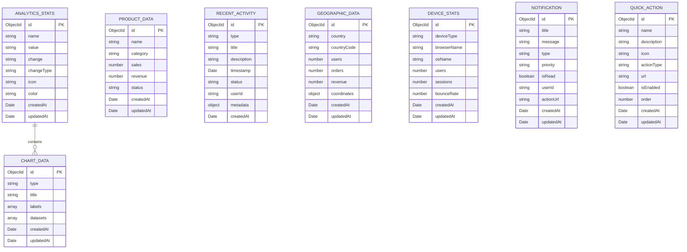

# Analytics 模块技术架构文档

## 1. 架构设计


## 2. 技术描述

- 前端：React@18 + TypeScript + Tailwind CSS + Vite + Chart.js
- 后端：Express.js@4 + TypeScript + Mongoose
- 数据库：MongoDB (通过 Mongoose ODM)
- 图表库：Chart.js@4 + React-Chartjs-2
- 状态管理：React Hooks (useState, useEffect, useContext)

## 3. 路由定义

| 路由 | 用途 |
|------|------|
| /analytics | Analytics 仪表板主页，显示12个功能模块 |
| /analytics/revenue | 收入详细分析页面 |
| /analytics/orders | 订单统计详细页面 |
| /analytics/users | 用户分析详细页面 |
| /analytics/products | 产品分析详细页面 |
| /analytics/reports | 报告导出和管理页面 |

## 4. API 定义

### 4.1 核心 API

**统计数据相关**
```
GET /api/analytics/stats
```

请求参数：
| 参数名称 | 参数类型 | 是否必需 | 描述 |
|----------|----------|----------|------|
| timeRange | string | false | 时间范围 (7d, 30d, 90d, 1y) |
| category | string | false | 统计类别筛选 |

响应：
| 参数名称 | 参数类型 | 描述 |
|----------|----------|------|
| name | string | 统计项名称 |
| value | string | 统计值 |
| change | string | 变化百分比 |
| changeType | string | 变化类型 (increase/decrease) |

示例：
```json
[
  {
    "name": "总收入",
    "value": "¥245,680",
    "change": "+12.5%",
    "changeType": "increase",
    "icon": "currency-dollar",
    "color": "emerald"
  }
]
```

**图表数据相关**
```
GET /api/analytics/charts/:type
```

请求参数：
| 参数名称 | 参数类型 | 是否必需 | 描述 |
|----------|----------|----------|------|
| type | string | true | 图表类型 (line, bar, doughnut, area, funnel) |
| period | string | false | 时间周期 |

响应：
| 参数名称 | 参数类型 | 描述 |
|----------|----------|------|
| type | string | 图表类型 |
| title | string | 图表标题 |
| labels | string[] | 数据标签 |
| datasets | object[] | 数据集合 |

**最近活动相关**
```
GET /api/analytics/activities
```

请求参数：
| 参数名称 | 参数类型 | 是否必需 | 描述 |
|----------|----------|----------|------|
| limit | number | false | 返回数量限制 |
| type | string | false | 活动类型筛选 |

**地理数据相关**
```
GET /api/analytics/geographic
```

响应：
| 参数名称 | 参数类型 | 描述 |
|----------|----------|------|
| country | string | 国家名称 |
| countryCode | string | 国家代码 |
| users | number | 用户数量 |
| orders | number | 订单数量 |
| revenue | number | 收入金额 |

**通知相关**
```
GET /api/analytics/notifications
PUT /api/analytics/notifications/:id/read
```

**快速操作相关**
```
GET /api/analytics/quick-actions
```

**仪表板汇总**
```
GET /api/analytics/dashboard-summary
```

## 5. 服务器架构图


## 6. 数据模型

### 6.1 数据模型定义



### 6.2 数据定义语言

**统计数据表 (analytics_stats)**
```sql
-- 创建统计数据集合
db.createCollection("analyticsstats", {
  validator: {
    $jsonSchema: {
      bsonType: "object",
      required: ["name", "value", "change", "changeType", "icon", "color"],
      properties: {
        name: { bsonType: "string" },
        value: { bsonType: "string" },
        change: { bsonType: "string" },
        changeType: { enum: ["increase", "decrease"] },
        icon: { bsonType: "string" },
        color: { bsonType: "string" }
      }
    }
  }
});

-- 初始化数据
db.analyticsstats.insertMany([
  {
    name: "总收入",
    value: "¥245,680",
    change: "+12.5%",
    changeType: "increase",
    icon: "currency-dollar",
    color: "emerald",
    createdAt: new Date(),
    updatedAt: new Date()
  },
  {
    name: "总订单",
    value: "1,247",
    change: "+8.2%",
    changeType: "increase",
    icon: "shopping-cart",
    color: "blue",
    createdAt: new Date(),
    updatedAt: new Date()
  },
  {
    name: "活跃用户",
    value: "8,549",
    change: "+15.3%",
    changeType: "increase",
    icon: "users",
    color: "purple",
    createdAt: new Date(),
    updatedAt: new Date()
  },
  {
    name: "转化率",
    value: "3.24%",
    change: "-2.1%",
    changeType: "decrease",
    icon: "trending-up",
    color: "amber",
    createdAt: new Date(),
    updatedAt: new Date()
  }
]);
```

**图表数据表 (chartdata)**
```sql
-- 创建图表数据集合
db.createCollection("chartdata");

-- 初始化收入趋势数据
db.chartdata.insertOne({
  type: "line",
  title: "收入趋势",
  labels: ["1月", "2月", "3月", "4月", "5月", "6月"],
  datasets: [{
    label: "月收入",
    data: [45000, 52000, 48000, 61000, 55000, 67000],
    borderColor: "#6366f1",
    backgroundColor: "rgba(99, 102, 241, 0.1)",
    tension: 0.4
  }],
  createdAt: new Date(),
  updatedAt: new Date()
});
```

**产品数据表 (productdata)**
```sql
-- 初始化产品数据
db.productdata.insertMany([
  {
    name: "iPhone 15 Pro",
    category: "电子产品",
    sales: 1247,
    revenue: 1247000,
    status: "In Stock",
    createdAt: new Date(),
    updatedAt: new Date()
  },
  {
    name: "MacBook Air M2",
    category: "电脑",
    sales: 856,
    revenue: 856000,
    status: "In Stock",
    createdAt: new Date(),
    updatedAt: new Date()
  }
]);
```

**最近活动表 (recentactivities)**
```sql
-- 初始化活动数据
db.recentactivities.insertMany([
  {
    type: "order",
    title: "新订单创建",
    description: "用户 John Doe 创建了新订单 #12345",
    timestamp: new Date(),
    status: "success",
    userId: "user123",
    createdAt: new Date()
  },
  {
    type: "user",
    title: "新用户注册",
    description: "新用户 Jane Smith 完成注册",
    timestamp: new Date(),
    status: "info",
    createdAt: new Date()
  }
]);
```

**地理数据表 (geographicdata)**
```sql
-- 初始化地理数据
db.geographicdata.insertMany([
  {
    country: "中国",
    countryCode: "CN",
    users: 5420,
    orders: 1247,
    revenue: 245680,
    coordinates: { lat: 35.8617, lng: 104.1954 },
    createdAt: new Date(),
    updatedAt: new Date()
  },
  {
    country: "美国",
    countryCode: "US",
    users: 2156,
    orders: 567,
    revenue: 123450,
    coordinates: { lat: 37.0902, lng: -95.7129 },
    createdAt: new Date(),
    updatedAt: new Date()
  }
]);
```

**快速操作表 (quickactions)**
```sql
-- 初始化快速操作
db.quickactions.insertMany([
  {
    name: "导出报告",
    description: "导出当前数据报告",
    icon: "document-arrow-down",
    actionType: "export",
    url: "/analytics/export",
    isEnabled: true,
    order: 1,
    createdAt: new Date(),
    updatedAt: new Date()
  },
  {
    name: "创建报告",
    description: "创建新的分析报告",
    icon: "plus-circle",
    actionType: "create",
    url: "/analytics/create-report",
    isEnabled: true,
    order: 2,
    createdAt: new Date(),
    updatedAt: new Date()
  }
]);
```