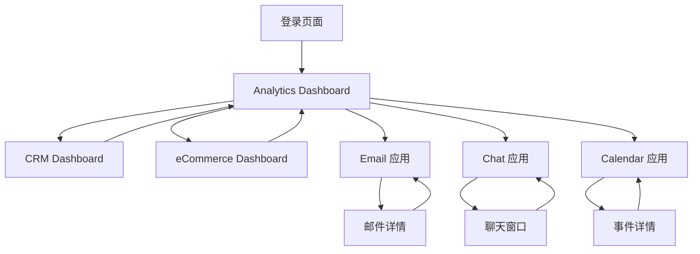

# Sneat Dashboard 克隆项目 - 产品需求文档

## 1. Product Overview

本项目旨在完全克隆 Sneat 管理面板的核心功能，包括三个主要仪表板（Analytics、CRM、eCommerce）和三个导航应用（Email、Chat、Calendar）。<mcreference link="https://demos.themeselection.com/sneat-bootstrap-html-admin-template/html/vertical-menu-template/dashboards-crm.html" index="1">1</mcreference> <mcreference link="https://themeselection.com/item/sneat-dashboard-pro-bootstrap/" index="2">2</mcreference>

- 项目将提供现代化的管理面板解决方案，支持企业级数据分析、客户关系管理和电商运营管理功能。
- 目标用户包括企业管理者、数据分析师、销售团队和客服人员，帮助他们高效管理业务数据和日常工作流程。
- 项目将成为一个功能完整的 SaaS 管理平台，具备高度的可定制性和扩展性。

## 2. Core Features

### 2.1 User Roles

本项目采用统一的用户视角，所有功能面向普通用户开放：

| Role | Registration Method | Core Permissions |
|------|---------------------|------------------|
| 普通用户 | 邮箱注册 | 完整访问所有仪表板功能，数据查看与管理，使用所有通讯和日程功能 |

### 2.2 Feature Module

我们的 Sneat Dashboard 克隆项目包含以下主要页面：

1. **Analytics Dashboard**: 数据分析概览，关键指标展示，图表可视化
2. **CRM Dashboard**: 客户关系管理，销售漏斗，客户数据统计
3. **eCommerce Dashboard**: 电商数据分析，订单管理，产品销售统计
4. **Email 应用**: 邮件收发，邮件管理，联系人管理
5. **Chat 应用**: 实时聊天，消息历史，在线状态
6. **Calendar 应用**: 日程管理，事件创建，提醒功能
7. **用户认证页面**: 登录注册，密码重置

### 2.3 Page Details

| Page Name | Module Name | Feature description |
|-----------|-------------|---------------------|
| Analytics Dashboard | 数据概览卡片 | 显示关键业务指标（收入、用户、订单、增长率）使用动态数字和进度条 |
| Analytics Dashboard | 图表区域 | 集成多种图表类型（折线图、柱状图、饼图、面积图）展示趋势数据 |
| Analytics Dashboard | 数据表格 | 可排序、可筛选的数据表格，支持分页和搜索功能 |
| CRM Dashboard | 销售漏斗 | 可视化销售流程各阶段，显示转化率和潜在客户数量 |
| CRM Dashboard | 客户统计 | 客户分类统计，地理分布图，客户价值分析 |
| CRM Dashboard | 活动时间线 | 显示最近的客户互动记录和销售活动 |
| eCommerce Dashboard | 销售概览 | 实时销售数据，热销产品排行，库存状态监控 |
| eCommerce Dashboard | 订单管理 | 订单状态跟踪，订单详情查看，批量操作功能 |
| eCommerce Dashboard | 产品分析 | 产品性能分析，分类销售对比，库存预警 |
| Email 应用 | 邮件列表 | 收件箱、发件箱、草稿箱，支持标签分类和搜索 |
| Email 应用 | 邮件编辑器 | 富文本编辑器，附件上传，模板选择功能 |
| Chat 应用 | 聊天界面 | 实时消息发送接收，表情符号，文件分享 |
| Chat 应用 | 联系人列表 | 在线状态显示，群组聊天，消息通知 |
| Calendar 应用 | 日历视图 | 月视图、周视图、日视图切换，事件拖拽编辑 |
| Calendar 应用 | 事件管理 | 事件创建编辑，提醒设置，重复事件配置 |
| 用户认证 | 登录页面 | 邮箱密码登录，记住我功能，社交登录选项 |
| 用户认证 | 注册页面 | 用户信息填写，邮箱验证，条款同意 |

## 3. Core Process

**主要用户操作流程：**

用户流程：
1. 用户访问登录页面进行身份验证
2. 登录成功后进入默认的 Analytics Dashboard
3. 通过侧边栏导航切换到不同的仪表板（CRM、eCommerce）
4. 使用顶部导航访问应用功能（Email、Chat、Calendar）
5. 在各个模块中查看数据、执行操作、管理内容
6. 可以自由使用所有功能模块，包括数据分析、客户管理、电商运营和通讯工具

## 4. User Interface Design

### 4.1 Design Style

- **主色调**: 深蓝色 (#696CFF) 作为主品牌色，白色 (#FFFFFF) 作为背景色
- **辅助色**: 灰色系 (#F5F5F9, #DBDADE) 用于边框和次要元素，成功绿 (#71DD37)，警告橙 (#FFB400)，错误红 (#FF4C51)
- **按钮样式**: 圆角按钮设计（border-radius: 6px），支持实心、空心、文字按钮三种样式
- **字体**: 使用 'Public Sans' 作为主字体，字号范围 12px-32px，行高 1.5
- **布局风格**: 卡片式布局设计，左侧固定导航栏，顶部应用导航，内容区域采用网格系统
- **图标样式**: 使用 Tabler Icons 图标库，线性风格，支持多种尺寸

### 4.2 Page Design Overview

| Page Name | Module Name | UI Elements |
|-----------|-------------|-------------|
| Analytics Dashboard | 数据概览卡片 | 白色卡片背景，彩色图标，大号数字显示，小型趋势图表，阴影效果 |
| Analytics Dashboard | 图表区域 | 响应式图表容器，工具提示，图例说明，颜色渐变效果 |
| CRM Dashboard | 销售漏斗 | 垂直漏斗图，百分比标签，颜色编码阶段，动画过渡效果 |
| eCommerce Dashboard | 销售概览 | 网格布局卡片，产品缩略图，价格标签，库存状态指示器 |
| Email 应用 | 邮件列表 | 列表项悬停效果，未读邮件加粗显示，时间戳，附件图标 |
| Chat 应用 | 聊天界面 | 消息气泡设计，发送者头像，时间戳，在线状态圆点 |
| Calendar 应用 | 日历视图 | 网格布局日历，事件色块，今日高亮，悬停预览 |

### 4.3 Responsiveness

项目采用移动优先的响应式设计策略：
- **桌面端** (≥1200px): 完整侧边栏 + 主内容区域布局
- **平板端** (768px-1199px): 可折叠侧边栏，优化触摸交互
- **移动端** (<768px): 底部导航栏，全屏内容显示，手势操作支持
- 支持触摸设备的滑动、点击、长按等交互方式
- 确保在 Chrome、Firefox、Safari 浏览器上的一致性体验