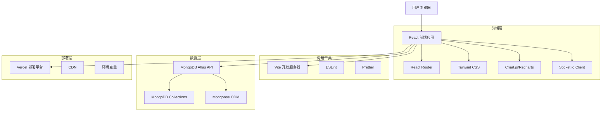
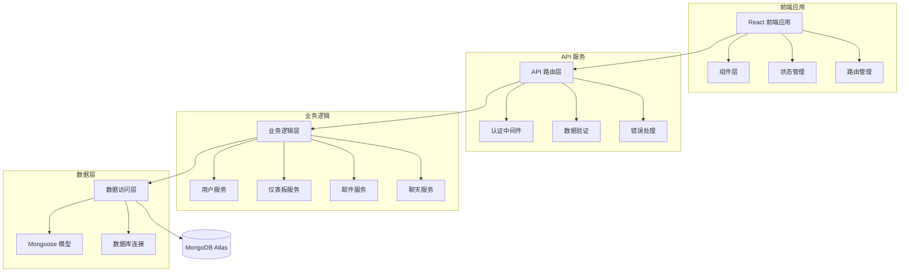
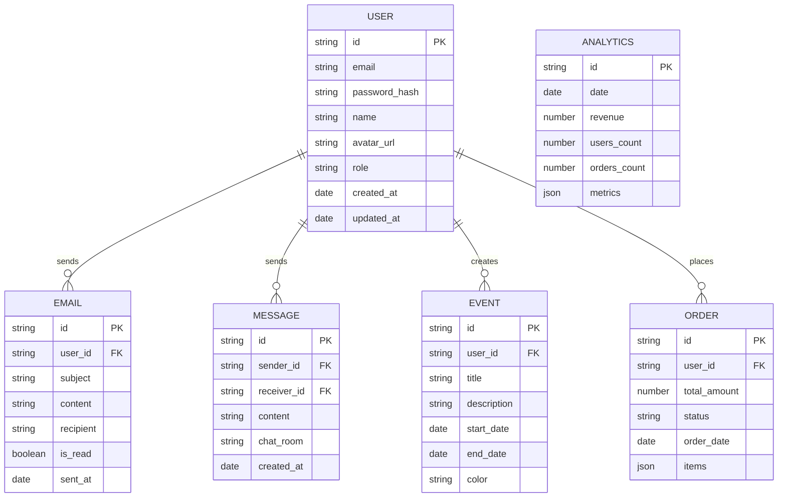

# Sneat Dashboard 克隆项目 - 技术架构文档

## 1. Architecture design



## 2. Technology Description

- **前端**: React@18 + TypeScript + Tailwind CSS@3 + Vite@4
- **状态管理**: Zustand (轻量级状态管理)
- **图表库**: Chart.js + React-Chartjs-2 (数据可视化)
- **UI组件**: Headless UI + Heroicons (无样式组件库)
- **实时通信**: Socket.io-client (聊天功能)
- **数据库**: MongoDB Atlas (云数据库服务)
- **ODM**: Mongoose (MongoDB 对象文档映射)
- **部署**: Vercel (前端部署平台)

## 3. Route definitions

| Route | Purpose |
|-------|---------|
| / | 重定向到 /login 或 /dashboard/analytics |
| /login | 用户登录页面，支持邮箱密码和社交登录 |
| /register | 用户注册页面，包含邮箱验证流程 |
| /dashboard/analytics | Analytics 仪表板，显示业务数据分析 |
| /dashboard/crm | CRM 仪表板，客户关系管理界面 |
| /dashboard/ecommerce | eCommerce 仪表板，电商数据统计 |
| /apps/email | Email 应用，邮件收发和管理 |
| /apps/email/:id | 邮件详情页面，显示单封邮件内容 |
| /apps/chat | Chat 应用，实时聊天界面 |
| /apps/calendar | Calendar 应用，日程管理功能 |
| /profile | 用户个人资料页面，账户设置 |
| /404 | 404 错误页面，页面未找到提示 |

## 4. API definitions

### 4.1 Core API

用户认证相关
```
POST /api/auth/login
```

Request:
| Param Name| Param Type  | isRequired  | Description |
|-----------|-------------|-------------|-------------|
| email     | string      | true        | 用户邮箱地址 |
| password  | string      | true        | 用户密码 |

Response:
| Param Name| Param Type  | Description |
|-----------|-------------|-------------|
| success   | boolean     | 登录是否成功 |
| token     | string      | JWT 访问令牌 |
| user      | object      | 用户基本信息 |

Example
```json
{
  "email": "user@example.com",
  "password": "password123"
}
```

仪表板数据获取
```
GET /api/dashboard/analytics
```

Response:
| Param Name| Param Type  | Description |
|-----------|-------------|-------------|
| revenue   | object      | 收入统计数据 |
| users     | object      | 用户增长数据 |
| orders    | object      | 订单统计信息 |
| charts    | array       | 图表数据集合 |

邮件管理
```
GET /api/emails
POST /api/emails
PUT /api/emails/:id
DELETE /api/emails/:id
```

聊天消息
```
GET /api/messages/:chatId
POST /api/messages
```

日历事件
```
GET /api/events
POST /api/events
PUT /api/events/:id
DELETE /api/events/:id
```

## 5. Server architecture diagram



## 6. Data model

### 6.1 Data model definition



### 6.2 Data Definition Language

用户表 (users)
```javascript
// MongoDB Collection Schema
const userSchema = new mongoose.Schema({
  _id: { type: mongoose.Schema.Types.ObjectId, auto: true },
  email: { type: String, required: true, unique: true },
  password_hash: { type: String, required: true },
  name: { type: String, required: true },
  avatar_url: { type: String, default: '' },
  role: { type: String, enum: ['admin', 'user'], default: 'user' },
  created_at: { type: Date, default: Date.now },
  updated_at: { type: Date, default: Date.now }
});

// 创建索引
userSchema.index({ email: 1 });
userSchema.index({ created_at: -1 });
```

邮件表 (emails)
```javascript
const emailSchema = new mongoose.Schema({
  _id: { type: mongoose.Schema.Types.ObjectId, auto: true },
  user_id: { type: mongoose.Schema.Types.ObjectId, ref: 'User', required: true },
  subject: { type: String, required: true },
  content: { type: String, required: true },
  recipient: { type: String, required: true },
  is_read: { type: Boolean, default: false },
  sent_at: { type: Date, default: Date.now }
});

emailSchema.index({ user_id: 1, sent_at: -1 });
```

消息表 (messages)
```javascript
const messageSchema = new mongoose.Schema({
  _id: { type: mongoose.Schema.Types.ObjectId, auto: true },
  sender_id: { type: mongoose.Schema.Types.ObjectId, ref: 'User', required: true },
  receiver_id: { type: mongoose.Schema.Types.ObjectId, ref: 'User', required: true },
  content: { type: String, required: true },
  chat_room: { type: String, required: true },
  created_at: { type: Date, default: Date.now }
});

messageSchema.index({ chat_room: 1, created_at: -1 });
```

事件表 (events)
```javascript
const eventSchema = new mongoose.Schema({
  _id: { type: mongoose.Schema.Types.ObjectId, auto: true },
  user_id: { type: mongoose.Schema.Types.ObjectId, ref: 'User', required: true },
  title: { type: String, required: true },
  description: { type: String, default: '' },
  start_date: { type: Date, required: true },
  end_date: { type: Date, required: true },
  color: { type: String, default: '#696CFF' }
});

eventSchema.index({ user_id: 1, start_date: 1 });
```

订单表 (orders)
```javascript
const orderSchema = new mongoose.Schema({
  _id: { type: mongoose.Schema.Types.ObjectId, auto: true },
  user_id: { type: mongoose.Schema.Types.ObjectId, ref: 'User', required: true },
  total_amount: { type: Number, required: true },
  status: { type: String, enum: ['pending', 'completed', 'cancelled'], default: 'pending' },
  order_date: { type: Date, default: Date.now },
  items: { type: Array, default: [] }
});

orderSchema.index({ user_id: 1, order_date: -1 });
orderSchema.index({ status: 1 });
```

分析数据表 (analytics)
```javascript
const analyticsSchema = new mongoose.Schema({
  _id: { type: mongoose.Schema.Types.ObjectId, auto: true },
  date: { type: Date, required: true, unique: true },
  revenue: { type: Number, default: 0 },
  users_count: { type: Number, default: 0 },
  orders_count: { type: Number, default: 0 },
  metrics: { type: Object, default: {} }
});

analyticsSchema.index({ date: -1 });
```

初始化数据
```javascript
// 创建默认管理员用户
db.users.insertOne({
  email: "admin@sneat.com",
  password_hash: "$2b$10$...", // bcrypt 加密后的密码
  name: "系统管理员",
  role: "admin",
  created_at: new Date(),
  updated_at: new Date()
});

// 插入示例分析数据
db.analytics.insertMany([
  {
    date: new Date('2024-01-01'),
    revenue: 125000,
    users_count: 1250,
    orders_count: 450,
    metrics: {
      conversion_rate: 3.6,
      avg_order_value: 278,
      bounce_rate: 42.5
    }
  }
]);
```